# THM-Anthem

## 1. SCOPE & TARGET DEFINITION 

**Scope Statement**

This vulnerability assessment is conducted within a controlled TryHackMe lab environment against the target machine "Anthem" (Windows-based). The assessment includes full port scanning, service enumeration, web application analysis, credential discovery, RDP exploitation, and privilege escalation. No destructive actions or lateral movement beyond the target is permitted.

**Target Description**

| Field | Value |
|-------|-------|
| Name | Anthem |
| Platform | TryHackMe (THM) |
| OS | Windows |
| IP Address | `10.49.160.141` |
| Difficulty | Easy |

**Justification:**

Windows target with realistic CMS (Umbraco) and RDP misconfigurations – common in enterprise environments.

**Simple Network Diagram**

```bash

[Kali Attack Machine]
    IP: (THM VPN assigned)
           |
           | Port 80 (HTTP)
           | Port 3389 (RDP)
           |
    [Anthem Target]
    IP: 10.49.160.141
           |
           |_ Web: Umbraco CMS (port 80)
           |_ Remote Desktop (port 3389)

```

## 2. METHODOLOGY, SCANNING & ANALYSIS 

**Step 1: Initial Port Scanning (Nmap)**

```bash

nmap -sC -sV -Pn 10.49.160.141
```

* Result scanning

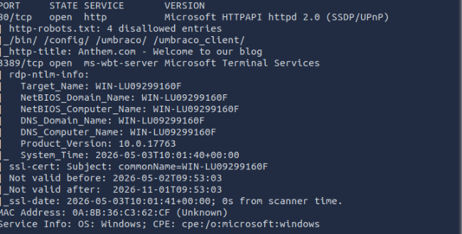


| Port | State | Service | Version | Potential Risk | Severity |
|:----:|:-----:|---------|---------|----------------|:--------:|
| 80 | Open | HTTP | IIS / Umbraco CMS | Web attack surface; admin panel exposure; potential RCE | High |
| 3389 | Open | RDP | Microsoft Terminal Services | Brute-force attacks; credential reuse; BlueKeep (CVE-2019-0708) | Critical |


**Step 2: Web Enumeration – robots.txt**

Command: 

```bash
curl http://10.48.128.146/robots.txt
```

Output:

```bash
User-agent: *
Disallow: /umbraco
Disallow: /content
... (4 entries total)
```
Finding: 
Contains *UmbracoIsTheBest!* which appears to be a password.

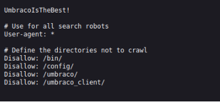

**Step 3: Web Enumeration – Page Source Analysis**

Visited: `http://10.48.128.146`

Findings from source code (Ctrl+U):

Flag found in source: `THM{...}` 

Author email pattern: JD@anthem.com (from "We Are Hiring" post)

* Email Pattern
  
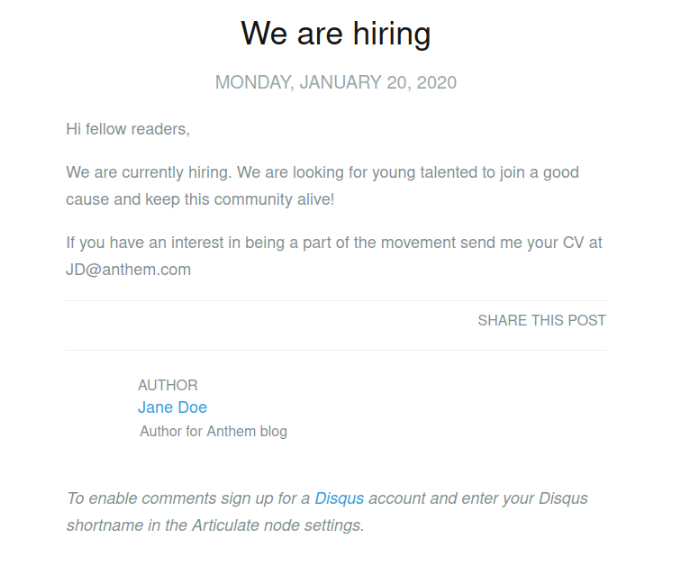

* Flag in View Page Source
  
  *Flag 1*
  
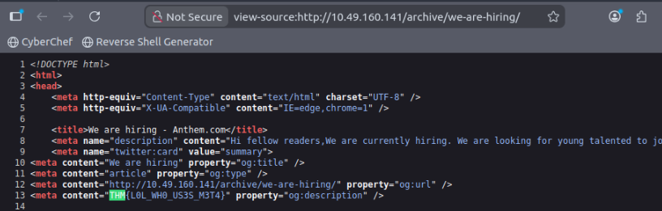

  *Flag 2*
  
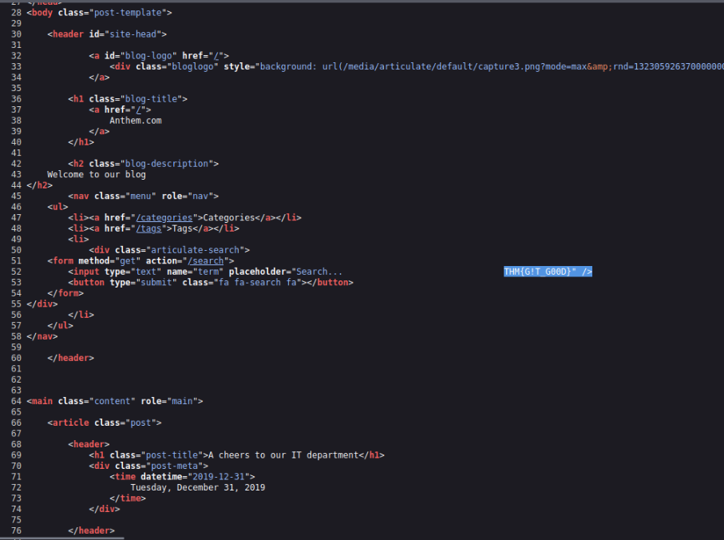

  *Flag 4*
  
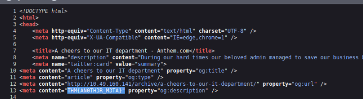

For Flag 3 we found it in the web page displaying in pages Authors/Jane Doe

  *Flag 3*
  
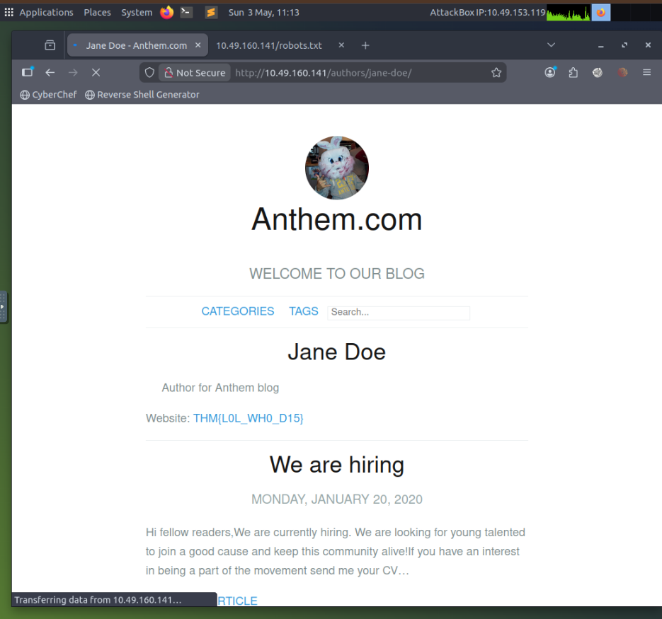


**Post 1 – "We Are Hiring":**

* Email found: JD@anthem.com

* Flag 1 & 2 found in source code

* Link to author revealed Flag 3


**Post 2 – "Cheers to Our IT Department":**


* Author name: James Orchard Halliwell

* Poem mentions "Solomon Grundy"

* Flag 4 found in source code

*Poem*

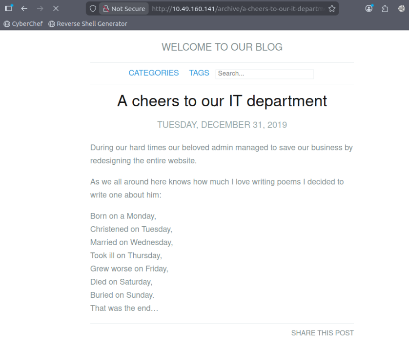

*Searching from Google About The Poem*

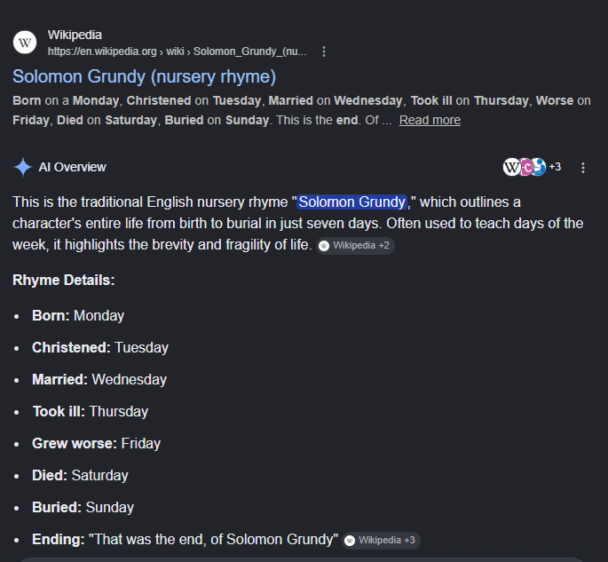


**Another Methods**

* We can also find the flag using `curl -s http://10.49.160.141/robots.txt | grep i- "THM"`
* Manage to find 3 Flags

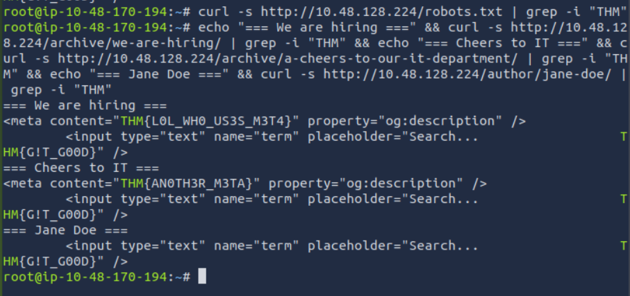


**Step 4: Credential Discovery & Validation**

| Username / Email              | Password Found        | Working? |
|------------------------------|----------------------|----------|
| JD@anthem.com                | (none yet)           | ❌ No     |
| sg@anthem.com (Solomon Grundy) | UmbracoIsTheBest!   | ✅ Yes    |

**Command to test web login:**

```bash
# Manual browser test at http://10.48.128.146/umbraco
# Credentials: sg@anthem.com : UmbracoIsTheBest!
```
* Successfull Login
  
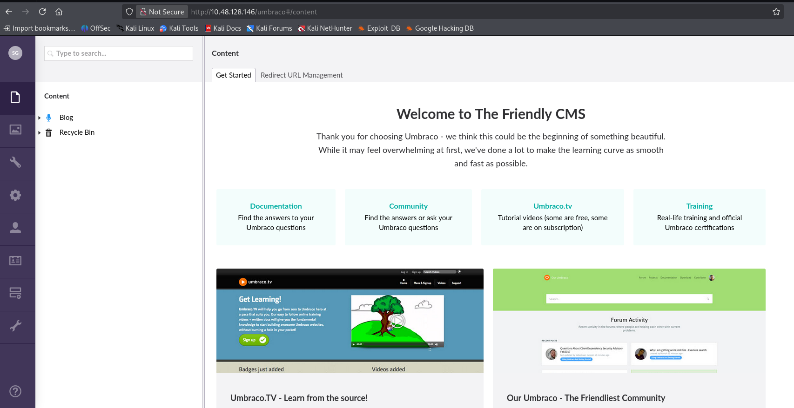

* Unfortunately theres nothing we can find in the CMS Admin Panel but we already know the Username and Password to Perform Next Step.


**Step 5: Initial Vulnerability Hypotheses**


| Finding                                      | Vulnerability Hypothesis                                              | CVSS Estimate     |
|---------------------------------------------|-----------------------------------------------------------------------|------------------|
| robots.txt exposes /umbraco + password      | Information disclosure leading to credential reuse                    | Medium (5.3)     |
| RDP port 3389 open with discovered password | Weak RDP credentials (sg user) – lateral movement risk                | High (7.5)       |
| Umbraco CMS exposed                         | Potential outdated CMS with known RCE (if public-facing)              | Critical (9.0)   |
