# THM-Anthem

## 1. SCOPE & TARGET DEFINITION 

**Scope Statement**

This vulnerability assessment is conducted within a controlled TryHackMe lab environment against the target machine "Anthem" (Windows-based). The assessment includes full port scanning, service enumeration, web application analysis, credential discovery, RDP exploitation, and privilege escalation. No destructive actions or lateral movement beyond the target is permitted.

**Target Description**

| Field | Value |
|-------|-------|
| Name | Anthem |
| Platform | TryHackMe (THM) |
| OS | Windows |
| IP Address | `10.49.160.141` |
| Difficulty | Easy |

**Justification:**

Windows target with realistic CMS (Umbraco) and RDP misconfigurations – common in enterprise environments.

**Simple Network Diagram**

```bash

[Kali Attack Machine]
    IP: (THM VPN assigned)
           |
           | Port 80 (HTTP)
           | Port 3389 (RDP)
           |
    [Anthem Target]
    IP: 10.49.160.141
           |
           |_ Web: Umbraco CMS (port 80)
           |_ Remote Desktop (port 3389)

```

## 2. METHODOLOGY, SCANNING & ANALYSIS 

**Step 1: Initial Port Scanning (Nmap)**

```bash

nmap -sC -sV -Pn 10.49.160.141
```

* Result scanning


| Port | State | Service | Version | Potential Risk | Severity |
|:----:|:-----:|---------|---------|----------------|:--------:|
| 80 | Open | HTTP | IIS / Umbraco CMS | Web attack surface; admin panel exposure; potential RCE | High |
| 3389 | Open | RDP | Microsoft Terminal Services | Brute-force attacks; credential reuse; BlueKeep (CVE-2019-0708) | Critical |


**Step 2: Web Enumeration – robots.txt**

Using nikto to find if theres robots.txt:

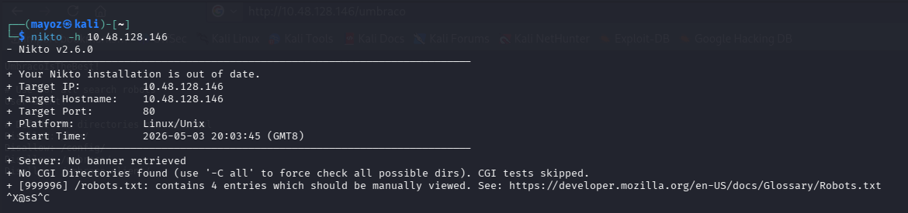


Then use curl enumration:

Command: 

```bash
curl http://10.49.160.141/robots.txt
```

Output:

```bash
User-agent: *
Disallow: /umbraco
Disallow: /content
... (4 entries total)
```
Finding: 
Contains *UmbracoIsTheBest!* which appears to be a password.


**Step 3: Web Enumeration – Page Source Analysis**

Visited: `http://10.49.160.141`

Findings from source code (Ctrl+U):

Flag found in source: `THM{...}` 

Author email pattern: JD@anthem.com (from "We Are Hiring" post)

* Email Pattern
  


* Flag in View Page Source

  *Flag 1*

```bash 
THM{L0L_WH0_US3S_M3T4}
 ```
 


  *Flag 2*

```bash 
THM{G!T_G00D}
 ```
  


  *Flag 4*

```bash 
THM{AN0TH3R_M3TA}
 ```  
  


For Flag 3 we found it in the web page displaying in pages Authors/Jane Doe

  *Flag 3*

```bash 
THM{L0L_WH0_D15}
 ```  


**Post 1 – "We Are Hiring":**

* Email found: `JD@anthem.com`

* Flag 1 & 2 found in source code

* Link to author revealed Flag 3


**Post 2 – "Cheers to Our IT Department":**


* Author name: James Orchard Halliwell

* Poem mentions "Solomon Grundy"

* Flag 4 found in source code

*Poem*


*Searching from Google About The Poem*


**Another Methods**

* We can also find the flag using `curl -s http://10.49.160.141/robots.txt | grep i- "THM"`
* Manage to find 3 Flags


**Step 4: Credential Discovery & Validation**

| Username / Email              | Password Found        | Working? |
|------------------------------|----------------------|----------|
| JD@anthem.com                | (none yet)           | ❌ No     |
| SG@anthem.com (Solomon Grundy) | UmbracoIsTheBest!   | ✅ Yes    |

**Command to test web login:**

```bash
# Manual browser test at http://10.49.160.141/umbraco
# Credentials: sg@anthem.com : UmbracoIsTheBest!
```
* Successfull Login
  


* Unfortunately theres nothing we can find in the CMS Admin Panel but we already know the Username and Password to Perform Next Step.


**Step 5: Initial Vulnerability Hypotheses**


| Finding                                      | Vulnerability Hypothesis                                              | CVSS Estimate     |
|---------------------------------------------|-----------------------------------------------------------------------|------------------|
| robots.txt exposes /umbraco + password      | Information disclosure leading to credential reuse                    | Medium (5.3)     |
| RDP port 3389 open with discovered password | Weak RDP credentials (sg user) – lateral movement risk                | High (7.5)       |
| Umbraco CMS exposed                         | Potential outdated CMS with known RCE (if public-facing)              | Critical (9.0)   |


## 3. EXPLOITATION & FLAG ACQUISITION

**Step 1 – RDP Login with Discovered Credentials:**

Using xfreerdp3

```bash
xfreerdp3 /v:10.49.160.141 /u:sg /p:'UmbracoIsTheBest!'
```

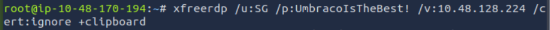

Or Using remmina 

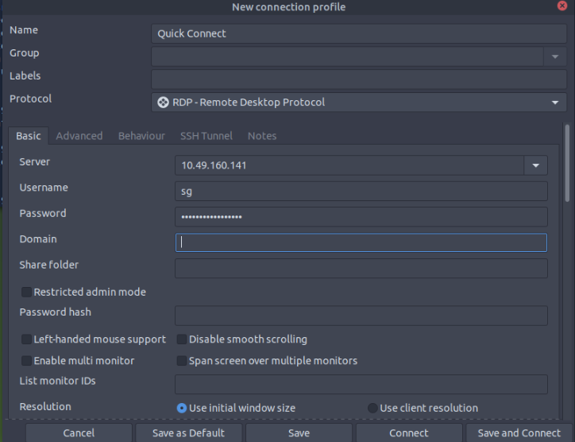

**Step 2 – Capture User Flag:**

* Navigate to desktop of user sg
* File: `user.txt` or similar

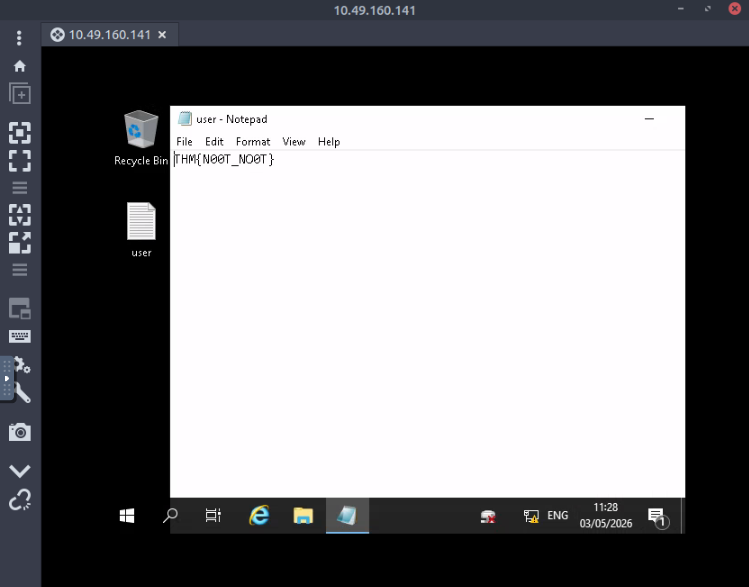

Find `user.txt` Flag:

```bash
THM{N00T_NO0T}
```


**Step 3 – Privilege Escalation – Hidden File:**

* We get Hint that the admin password is Hidden.

```bash
# In Windows RDP session
# Enable "Show hidden files" in File Explorer
# Navigate to C:\backup\
# File: restore.txt
```

*Step 1*

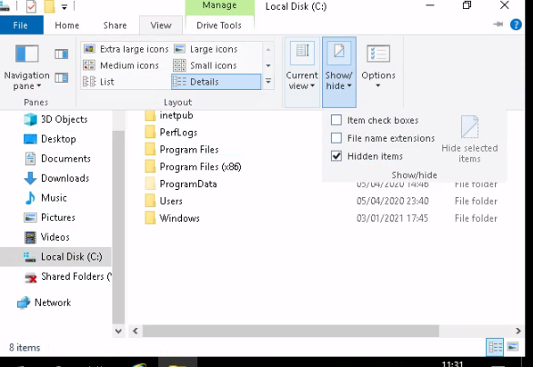


*Step 2*

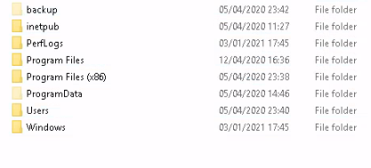


*Step 3*

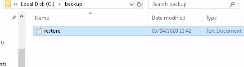

*Step 4* - Can't Open

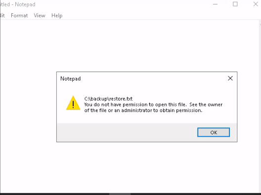


**Step 4 – Read restore.txt (Permission Fix):**

Right-click `restore.txt` → Properties → Security

Add `sg` user with read permission

* Add user
  
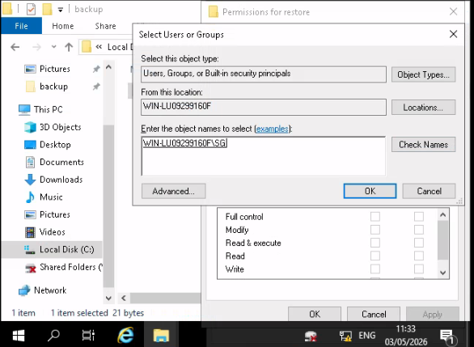

* Give permission
  
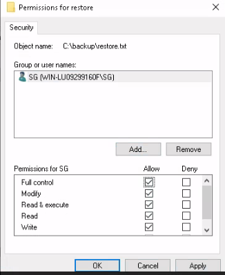


* Open File Again and Successfull
  
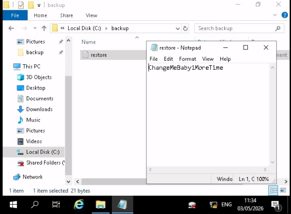

Password found: `ChangeMeBaby1MoreTime`

**Step 5 – Root RDP Login:**

```bash
# Go to This Pc Navigate to C:\Users\Administrator
# Fill in the Credentials 
# Go to Desktop File: root.txt
```

* Go to This Pc Navigate to C:\Users\Administrator

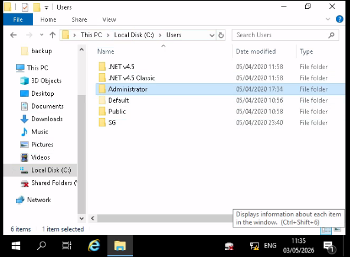

* Fill in the Credentials 

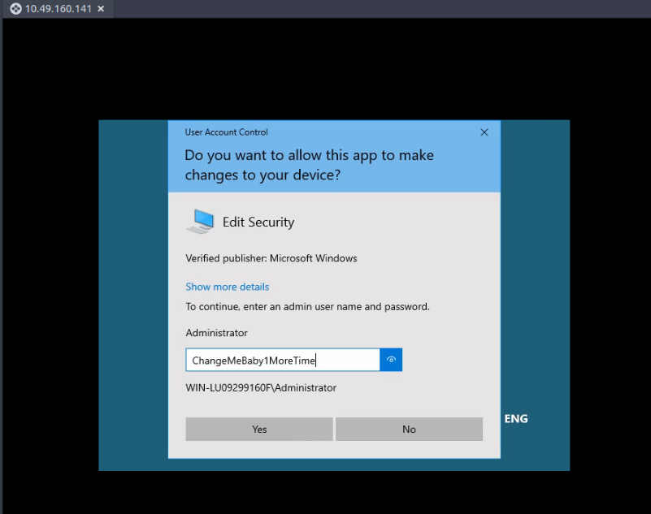

* Go to Desktop File: root.txt 

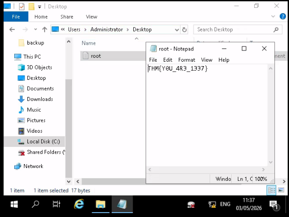

Capture Root Flag:

```bash
THM{Y0U_4R3_1337}
```

Location: Administrator desktop

File: `root.txt` 

## Flags Obtained

| Flag Type | Value | Discovery Method |
|-----------|-------|------------------|
| Flag 1 (Source code) | `THM{L0L_WH0_US3S_M3T4}` | View page source on homepage/ `curl grep -i` |
| Flag 2 (Source code) | `THM{G!T_G00D}` | View page source on blog post/ `curl grep -i` |
| Flag 3 (Source code) | `THM{L0L_WH0_D15}` | View page source in author link |
| Flag 4 (Source code) | `THM{AN0TH3R_M3TA}` | View page source on second blog post/ `curl grep -i` |
| User Flag | `THM{N00T_NO0T}` | RDP desktop as `sg` user |
| Admin Flag (Root) | `THM{Y0U_4R3_1337}` | RDP desktop as `administrator` after privilege escalation |


## Summary

A vulnerability assessment was performed on the TryHackMe target "Anthem" (Windows-based, IP: 10.48.128.146). Scanning revealed open ports 80 (HTTP) and 3389 (RDP). Nikto discovered `/robots.txt` containing the password `UmbracoIsTheBest!`, while manual page source review revealed email patterns and flags. Using the discovered credentials, RDP access was gained as user `sg` to capture the user flag. Further enumeration found a hidden file `C:\backup\restore.txt`; modifying its permissions allowed reading the administrator password `ChangeMeBaby1MoreTime`. RDP access as `administrator` led to the admin flag, achieving full system compromise.

## Problem Facing

Throughout this writeup, I encountered several technical challenges that affected my workflow.


**1. Time Limitation & Bug on TryHackMe Attack Box**

Initially, I used the TryHackMe Attack Box. However, the free tier has a limitation of only 1 hour per day. To extend the session, there is supposed to be an "Add 1 Hour" button that can be clicked when the time is about to run out.


**The problem:**

Even after clicking the "Add 1 Hour" button, the system seemed to have a bug — 

the remaining time did not update. As a result, the Attack Box still expired, and I was forced to restart the Attack Machine from scratch.


**2. Impact of the Issue**

**Multiple IP Addresses –**

Due to several restarts, this writeup contains different IP addresses for the same attack sequence.


**Disrupted Workflow –**

The process of writing the writeup became non-linear, as I had to wait for the machine to become ready again.


## Tools Used

| Tool | Purpose |
|------|---------|
| `nmap -sC -sV -Pn` | Port scanning and service version detection |
| Nikto | Automated web scan to discover `/robots.txt` |
| `curl \| grep -i` | Retrieve and search `/robots.txt` for credentials |
| View Page Source (Ctrl+U) | Hidden flag discovery in HTML comments |
| xfreerdp3 | CLI RDP client for Windows remote access |
| Remmina | GUI RDP client for visual enumeration |
| Windows File Explorer (Properties) | Permission modification for privilege escalation |
